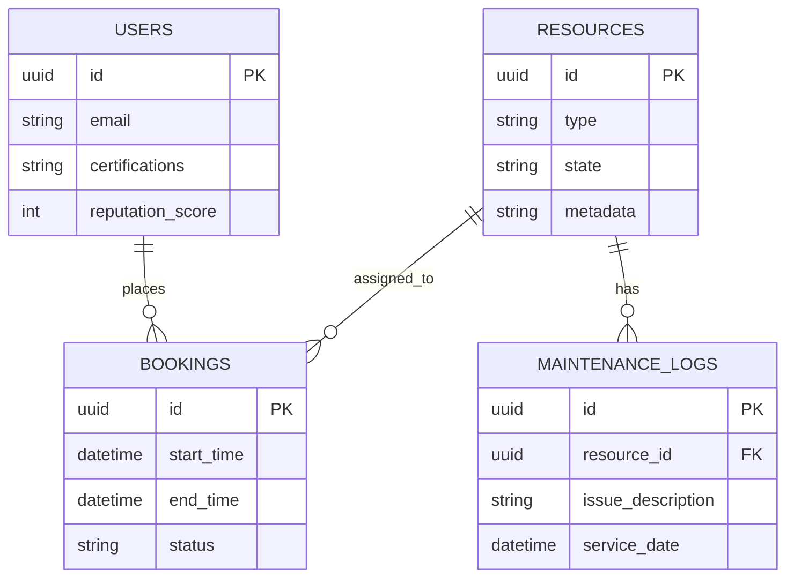

```mermaid
erDiagram

    USERS ||--o{ BOOKINGS : places
    RESOURCES ||--o{ BOOKINGS : assigned_to
    RESOURCES ||--o{ MAINTENANCE_LOGS : has

    USERS {
        uuid id PK
        string email
        string certifications
        int reputation_score
    }

    RESOURCES {
        uuid id PK
        string type
        string state
        string metadata
    }

    BOOKINGS {
        uuid id PK
        datetime start_time
        datetime end_time
        string status
    }

    MAINTENANCE_LOGS {
        uuid id PK
        uuid resource_id FK
        string issue_description
        datetime service_date
    }
```
