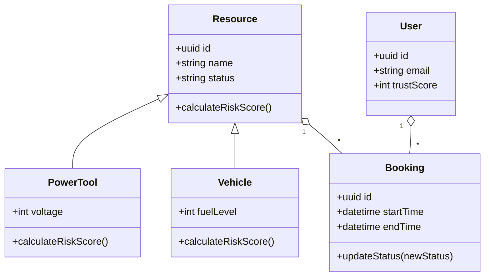

```mermaid
classDiagram

    class Resource {
        +uuid id
        +string name
        +string status
        +calculateRiskScore()
    }

    class PowerTool {
        +int voltage
        +calculateRiskScore()
    }

    class Vehicle {
        +int fuelLevel
        +calculateRiskScore()
    }

    class User {
        +uuid id
        +string email
        +int trustScore
    }

    class Booking {
        +uuid id
        +datetime startTime
        +datetime endTime
        +updateStatus(newStatus)
    }

    Resource <|-- PowerTool
    Resource <|-- Vehicle
    User "1" o-- "*" Booking
    Resource "1" o-- "*" Booking
```
