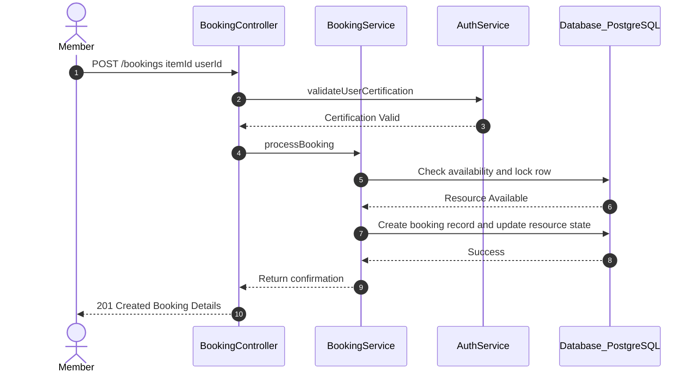

```mermaid
sequenceDiagram
    autonumber

    actor Member
    participant Controller as BookingController
    participant Service as BookingService
    participant Auth as AuthService
    participant DB as Database_PostgreSQL

    Member->>Controller: POST /bookings itemId userId
    Controller->>Auth: validateUserCertification
    Auth-->>Controller: Certification Valid

    Controller->>Service: processBooking
    Service->>DB: Check availability and lock row
    DB-->>Service: Resource Available

    Service->>DB: Create booking record and update resource state
    DB-->>Service: Success

    Service-->>Controller: Return confirmation
    Controller-->>Member: 201 Created Booking Details
```
