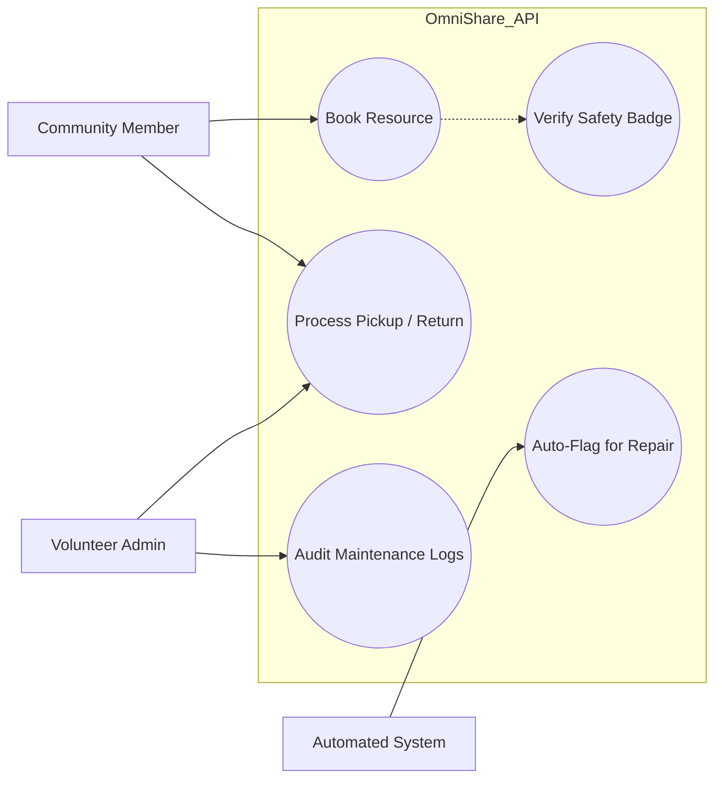

```mermaid
flowchart LR

    M[Community Member]
    A[Volunteer Admin]
    S[Automated System]

    subgraph OmniShare_API
        UC1((Book Resource))
        UC2((Verify Safety Badge))
        UC3((Process Pickup / Return))
        UC4((Audit Maintenance Logs))
        UC5((Auto-Flag for Repair))
    end

    M --> UC1
    M --> UC3
    UC1 -.-> UC2

    A --> UC3
    A --> UC4

    S --> UC5
```
